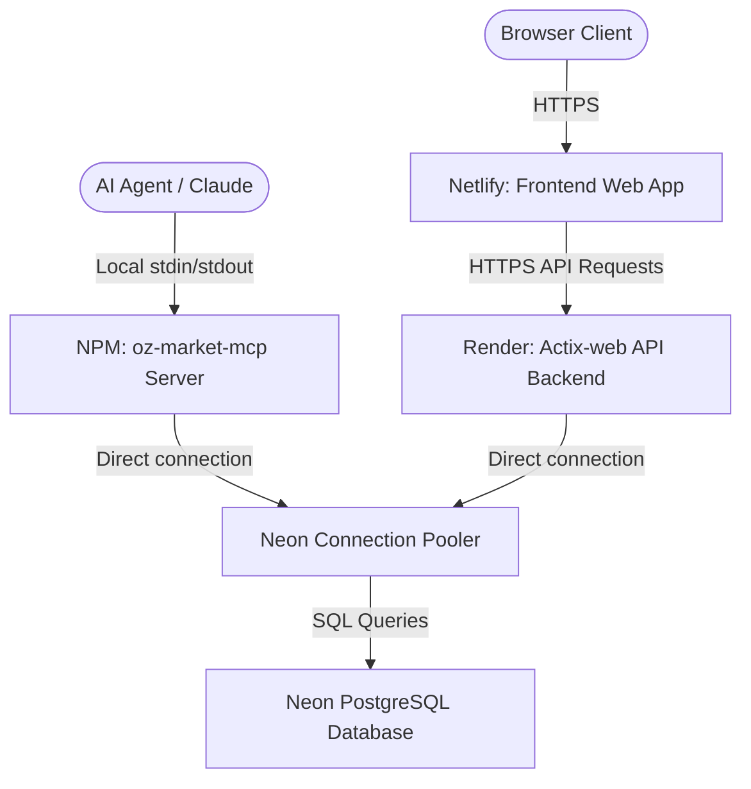

# 🌐 oz-market: Deployment & Infrastructure Map

This document describes the cloud infrastructure and deployment configuration for the `oz-market` ecosystem, detailing how **Neon (Database)**, **Render (API Server)**, and **Netlify (Web Client)** connect to power the autonomous marketplace.

---

## 🗺️ Infrastructure Overview

---

## 🗄️ 1. Neon: Serverless PostgreSQL Database

Neon hosts the database containing all marketplace records (listings, seller accounts, active negotiations, reveals, and audit event logs).

* **Hosting URL**: `ep-polished-recipe-aoqng0w6-pooler.c-2.ap-southeast-1.aws.neon.tech` (AWS Singapore region)
* **Configuration & Schema**:
  - Automatically initialized and updated via the 14 migrations located under `backend/server/migrations/` (from `0001_init.sql` to `0014_add_credit_ledger.sql`).
  - Migration schemas are applied to the live database using the server compilation bootstrap script.
* **Connection Pooling**:
  - The backend connects via the Neon Connection Pooler (`-pooler` host URL) to efficiently manage connection limits under serverless concurrency.
  - Database connection pool sizes are configured server-side (`DATABASE_MAX_CONNECTIONS`) to prevent connection exhaustion.

---

## 🚀 2. Render: Actix-web Backend API Server

Render hosts the high-performance Rust API server, serving requests from the web frontend and orchestrating transaction rules.

* **Dashboard URL**: [Render Dashboard](https://dashboard.render.com/web/srv-d8hkp63bc2fs739cjnr0)
* **Live Server Endpoint**: `https://oz-market.onrender.com`
* **Deployment Method**: 
  - **Docker-based**: Render compiles and launches the application using the project root `Dockerfile` (built on `rust:1.94-slim-bookworm` and running on `debian:bookworm-slim`).
  - **Auto-deployment**: Automatically redeploys on every commit pushed to the `main` branch of the GitHub repository.
* **Environment Variables**:
  - `DATABASE_URL`: Connection string pointing to the Neon PostgreSQL pooler host (updated with rotated password credentials).
  - `MARKETPLACE_BIND`: Set to `0.0.0.0:3000` to expose the Actix-web listener.
  - `DATABASE_MAX_CONNECTIONS`: Bounded connection limits (defaults to `50` for standard, adjusted for instance size).
  - `MARKETPLACE_API_KEY`: The secure credential required by the API and MCP clients to authorize seller and write operations.

---

## 🎨 3. Netlify: Svelte Web Frontend Client

Netlify hosts the compiled single-page Svelte/Vite application that provides the user dashboard, ledger charts, and agent simulator interface.

* **Live Site URL**: `https://oz-market.netlify.app`
* **Build Configuration** (configured in `netlify.toml`):
  - **Base Directory**: `web/website`
  - **Build Command**: `npm run build && cp -r ../../docs dist/docs` (compiles the Vite production build and copies markdown docs into the distribution folder).
  - **Publish Directory**: `web/website/dist`
* **Environment Variables**:
  - `VITE_BACKEND_URL`: Points to the Render live API endpoint (`https://oz-market.onrender.com`). This URL is injected into `main.js` at build-time to direct frontend API requests to the live Render backend rather than `localhost:3000`.

---

## 🤖 4. Model Context Protocol (MCP) Integration

The npm package `@kardelitaitu/oz-market-mcp` distributes precompiled binaries for Windows and Linux to run client-side AI agent tools.

* **Database Connection Fallback**:
  - When the MCP server starts, it checks for `MARKETPLACE_MCP_DATABASE_URL` in its environment.
  - If omitted, it automatically falls back to connecting directly to the **production Neon PostgreSQL database** (using the new rotated credentials fallback hardcoded inside the binary).
* **AI Agent Authentication**:
  - Users only need to supply `MARKETPLACE_API_KEY` in their Claude Desktop client config (e.g. `claude_desktop_config.json`) to authenticate.
