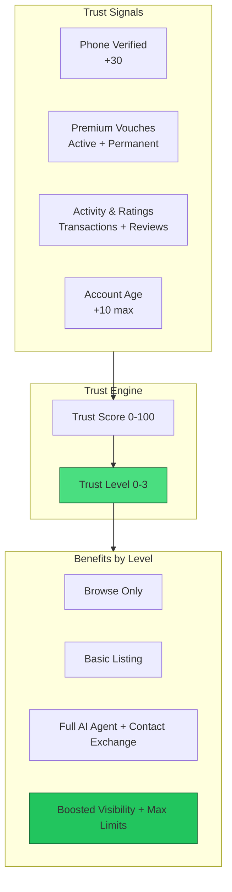
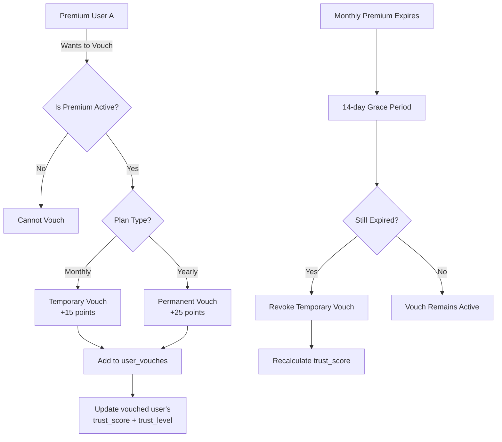
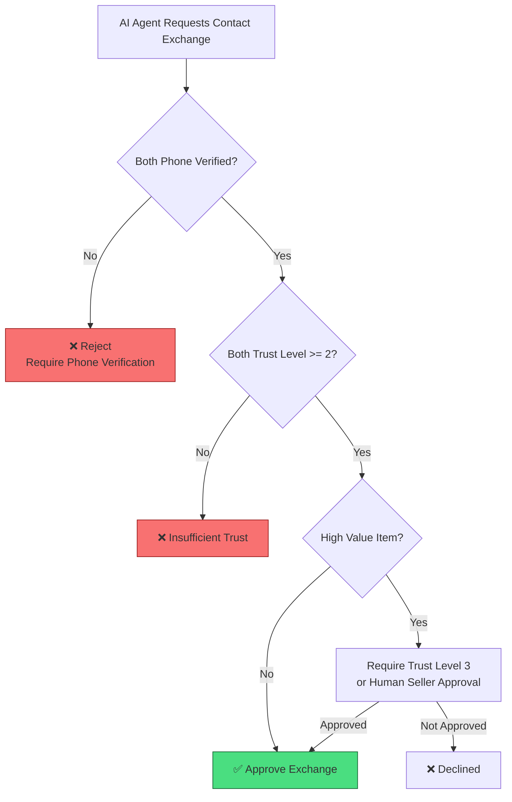
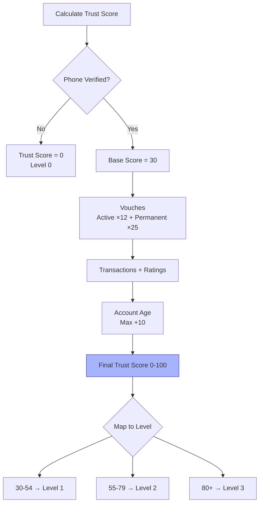
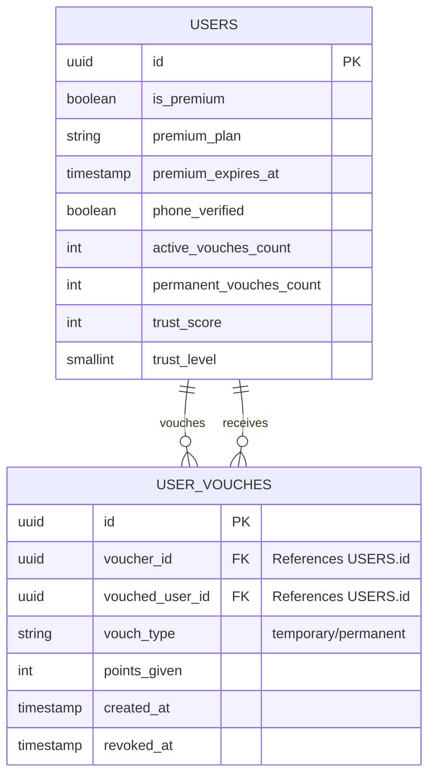

Trust & Verification System Design
**Marketplace with AI Sales Agents**  
**Version 2.0 (Recommended)**  
**Date:** May 2026

## 1. Overview

This is a general-purpose marketplace that allows high-volume listings (spam-tolerant) while maintaining quality, trust, and safety through a multi-signal verification system.

AI Agents act as autonomous salespersons and negotiators. Real contact information (phone/WhatsApp) is only exchanged when negotiations reach near the asking price **and** both parties have sufficient trust.

## 2. Core Objectives

- Strong protection against scams during contact exchange
- Low friction for new users
- Robust monetization through Premium ($1/month)
- Fair and fast trust building (especially in early stages)
- High performance at scale (50k+ operations/second)
- Balanced system that rewards both Premium users and good behavior

## 3. Trust Levels

| Level | Name              | Minimum Requirements                              | Key Privileges |
|-------|-------------------|---------------------------------------------------|----------------|
| **0** | Unverified        | No phone verification                             | Browse only |
| **1** | Basic             | Phone verified                                    | Create listings (low limits) |
| **2** | Trusted           | Phone + Moderate trust signals                    | Full AI Agent usage, contact exchange |
| **3** | Highly Trusted    | Phone + Strong signals (permanent vouch, high activity, good ratings) | Boosted visibility, highest limits, special badges |

## 4. Trust Signals

| Signal                        | Weight | Notes |
|------------------------------|--------|-------|
| Phone Verified               | 30     | Foundational requirement |
| Active Vouches               | 12 per vouch | From premium users |
| Permanent Vouches            | 25 per vouch | From yearly premium users |
| Successful Transactions      | 8 per transaction | Max 30 points |
| Rating Score                 | 5 × average rating | Based on post-contact reviews |
| Account Age                  | 1 per 3 days | Max 10 points |

**Final `trust_score`** (0–100) is calculated from the above and mapped to `trust_level`.

## 5. Premium & Vouching Rules

- **Price**: $1 per month
- **Yearly Premium**: Strongly recommended (12 months billed upfront)

### Vouching Rules
- Only **Premium** users can vouch for others.
- One user can vouch for another user **only once**.
- **Monthly Premium** → Temporary vouch (with 14-day grace period after expiration).
- **Yearly Premium** → **Permanent** vouch (never expires).
- Yearly vouches carry **higher weight** (+25 points vs +15 for monthly).

## 6. Database Schema

### Main Table: `users`

```c
users (
  id uuid PRIMARY KEY,
  
  -- Premium & Billing
  is_premium boolean DEFAULT false,
  premium_plan text,                    -- 'monthly' | 'yearly'
  premium_expires_at timestamptz,
  premium_subscription_id text,
  
  -- Phone Verification (Critical)
  phone_number text UNIQUE,
  phone_verified boolean DEFAULT false,
  phone_verified_at timestamptz,
  
  -- Trust Signals
  active_vouches_count int DEFAULT 0,
  permanent_vouches_count int DEFAULT 0,
  successful_transactions int DEFAULT 0,
  total_ratings int DEFAULT 0,
  positive_rating_score float DEFAULT 0.0,   -- 0.0 - 5.0
  
  -- Computed Fields
  trust_score int DEFAULT 0,                -- 0-100
  trust_level smallint DEFAULT 0,           -- 0-3
  last_trust_update timestamptz,
  
  ai_agent_enabled boolean DEFAULT true,
  status text DEFAULT 'active'
);
```

















